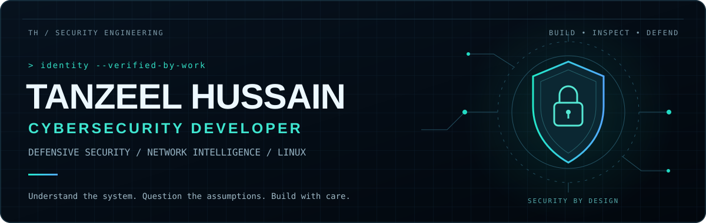

  

  
  
  

<h2>01 / SECURITY MINDSET</h2>

I build tools that make systems easier to inspect, threats easier to investigate, and security decisions easier to explain.

My focus is **defensive security, network intelligence, and systems development**—from packet and log analysis to application security and authenticated device communication.

> **Make trust explicit. Keep the evidence visible. Engineer for failure.**

<h2>02 / OPERATIONAL FOCUS</h2>

<table>
<tr>
<td width="50%" valign="top">
<h3>🛡️ Defensive Engineering</h3>
Authentication · Access boundaries 
Input validation · Security automation
</td>
<td width="50%" valign="top">
<h3>📡 Network Intelligence</h3>
Packet inspection · Traffic analysis 
Log investigation · Threat reporting
</td>
</tr>
<tr>
<td width="50%" valign="top">
<h3>⚙️ Systems Development</h3>
Linux tooling · Desktop software 
Resource management · Failure recovery
</td>
<td width="50%" valign="top">
<h3>🔐 Connected-Device Security</h3>
Message authentication · Encryption 
Replay protection · Device communication
</td>
</tr>
</table>

<h2>03 / TOOLKIT</h2>

SECURITY &amp; SYSTEMS

 &nbsp;
 &nbsp;
 &nbsp;
 &nbsp;
 &nbsp;

LANGUAGES

 &nbsp;
 &nbsp;
 &nbsp;
 &nbsp;

APPLICATIONS &amp; DATA

 &nbsp;
 &nbsp;
 &nbsp;
 &nbsp;
 &nbsp;

<h2>04 / ENGINEERING STANDARD</h2>

**Explicit boundaries.** Validate what enters a system and define who can act. 
**Readable internals.** Separate responsibilities and document the decisions. 
**Predictable failure.** Handle errors, release resources, and support recovery. 
**Evidence over claims.** Test behavior and distinguish results from assumptions.

---

<strong>SECURITY TOOLING &nbsp; / &nbsp; TECHNICAL COLLABORATION &nbsp; / &nbsp; SOFTWARE DEVELOPMENT</strong>  
<a href="mailto:tanzeelhussain38529@gmail.com">Start a conversation ↗</a>

Built with intent. Backed by understanding.

